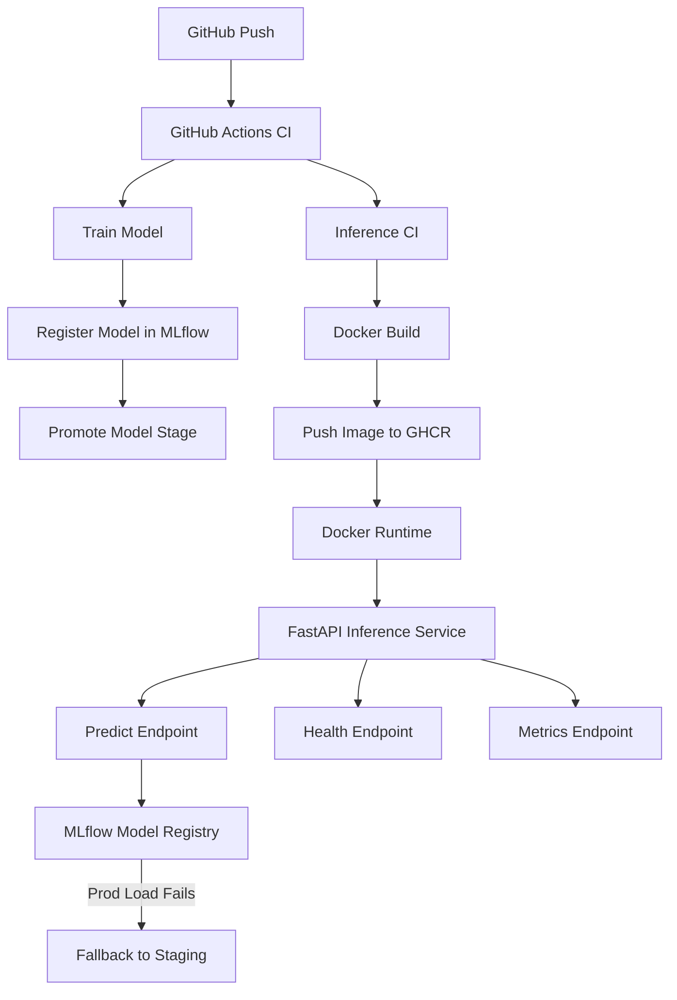

# 🔐 Autonomous Security MLOps Platform

Production-grade **MLOps + Secure Inference System** for detecting suspicious access patterns in application logs, featuring **safe model deployment, CI/CD, runtime health checks, metrics, and fallback mechanisms**.

This project demonstrates **real-world MLOps engineering practices** — not a toy pipeline.

---

## 🚨 Problem Statement

Modern applications generate massive security logs:
- Failed login attempts
- Privilege escalation
- SQL injection patterns
- Admin endpoint abuse

Manual rule-based systems fail at scale.

### 🎯 Goal
Build an **autonomous ML-powered security inference service** that:
- Trains models via CI
- Registers models in MLflow
- Deploys safely to production
- Handles failures gracefully
- Exposes health & metrics for monitoring

---

## 🧠 Key Features

### ✅ End-to-End MLOps
- Model training + promotion via CI
- MLflow Model Registry
- Automatic deployment to GHCR

### 🔁 Safe Model Fallback
- **Production → Staging → Fail**
- Prevents outages due to broken prod models

### 🔐 Security Hardening
- API key authentication
- Rate limiting (SlowAPI)
- Non-root Docker runtime

### 📊 Observability
- `/health` → runtime readiness
- `/metrics` → Prometheus-compatible metrics
- Model stage visibility at runtime

### 🚀 Deployment Ready
- Dockerized inference service
- GHCR image registry
- Environment-based configuration

---

## 🏗️ System Architecture

---

## Project Structure

---

## 🔄 CI/CD Pipeline
GitHub Actions Workflow

Train & Validate

Pull data via DVC

Train model

Log to MLflow

Promote model stage

Inference CI

Import FastAPI app

Load model from MLflow

Validate runtime safety

Build & Push

Docker build

Tag (SHA, staging, latest)

Push to GHCR

---

## 🧠 Safe Model Loading Logic

Requested Stage → Try Load
        |
        v
Fails? → Fallback to STAGING
        |
        v
Fails? → HARD FAIL (Correct behavior)

Ensures:

No silent failures

No serving broken models

Transparent runtime state

---

## 🧪 API Endpoints
🔍 Health Check
GET /health

Response:

{
  "status": "ok",
  "model_loaded": true,
  "served_stage": "Production"
}

---

## 📊 Metrics (Prometheus)
GET /metrics

Example metric:

model_loaded_stage{stage="Production"} 1

---
## 🤖 Prediction API
POST /predict
X-API-Key: <key>

Payload:

{
  "event_hour": 14,
  "is_login_failure": 1,
  "is_privilege_change": 0,
  "request_length": 180,
  "has_sql_keywords": 1,
  "is_admin_path": 1
}

Response:

{
  "prediction": 1,
  "probability": 1.0,
  "risk_level": "CRITICAL",
  "latency_ms": 26.3,
  "model_stage": "Production"
}

---

## 🚀 Run Locally (Docker)
docker run -d -p 8000:8000 \
  -e INFERENCE_API_KEY=dev-key \
  -e INFERENCE_MODEL_STAGE=Staging \
  ghcr.io/<user>/autonomous-security-mlops/security-inference:latest

---

## 🔐 Environment Variables

| Variable                | Description          |
| ----------------------- | -------------------- |
| `INFERENCE_API_KEY`     | API auth key         |
| `INFERENCE_MODEL_STAGE` | Production / Staging |
| `MLFLOW_TRACKING_URI`   | MLflow registry      |
| `RATE_LIMIT`            | Request rate limit   |

---

## 📈 Monitoring & Future Extensions

✔ Prometheus metrics
✔ Load balancer health checks
⏳ Alerting (Grafana)
⏳ Canary deployments
⏳ Kubernetes (future)

---

## 🧠 Design Philosophy

Fail loudly, not silently

Observability > blind automation

Security first

CI as a gatekeeper

Production realism over demos

---

## 👨‍💻 Author

Reeth Jain
Data Science • MLOps • Security ML
GitHub: https://github.com/reethj-07

---

⭐ Why This Project Matters

This project reflects:

Real-world MLOps patterns

Safe production deployments

Engineering maturity beyond notebooks

If you're evaluating this repo — this is how ML systems should be built.

---